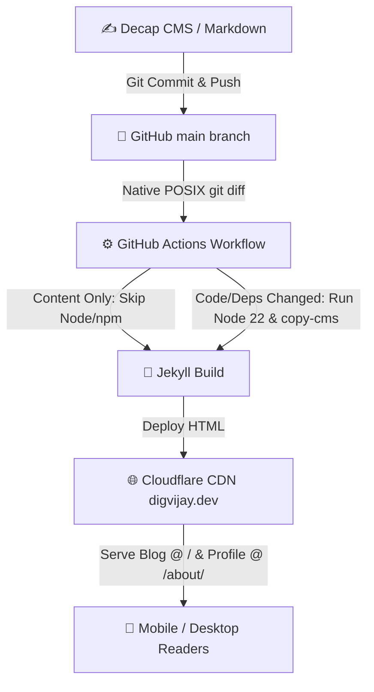

# 🌌 digvijay.dev

[](https://github.com/Digvijay/digvijay.github.io/actions/workflows/deploy.yml)
[](https://nodejs.org/)
[](https://jekyllrb.com/)
[](https://www.cloudflare.com/)
[](https://decapcms.org/)

Source code for [digvijay.dev](https://digvijay.dev) - static blog and profile site built with Jekyll, Decap CMS, Cloudflare Workers, and GitHub Pages.

---

## 🛠️ Systems & Deployment Architecture



- **Site Structure**: Main Blog articles hosted at root (`/`), professional profile & career details at `/about/`.
- **Static Engine**: [Jekyll v4.3](https://jekyllrb.com/) with Liquid templates and fluid clamp typography.
- **Content Management**: [Decap CMS](https://decapcms.org/) visual editor at `/admin/` with custom dark-mode live preview (`cms-preview.css`).
- **Authentication**: Standalone Cloudflare Worker (`cloudflare-oauth-worker`) providing secure GitHub 2FA OAuth authentication.
- **Zero-Trust CI Pipeline**: Built using 100% native GitHub Actions & POSIX `git diff` script (zero 3rd-party action dependencies). Markdown edits skip Node/npm setup entirely for sub-18s builds.
- **Runtime Environment**: Node.js **v22** pinned locally via [`mise`](https://mise.jdx.dev/) (`mise.toml`).

---

## 📂 Repository Structure

```text
├── .github/workflows/deploy.yml # GitHub Actions Jekyll build & deploy workflow (Zero-trust native git diff)
├── _layouts/
│   ├── default.html             # Main site shell & responsive header
│   └── post.html                # Medium-style reading layout
├── _posts/                      # Blog articles in Markdown
├── about/index.html             # Profile & career page (/about/)
├── admin/                       # Decap CMS visual editor & preview styles
├── cloudflare-oauth-worker/     # OAuth worker for GitHub 2FA authentication
├── index.html                   # Main site homepage (Blog listing)
├── mise.toml                    # Environment runtime pin (Node 22)
└── CNAME                        # Custom domain binding (digvijay.dev)
```

---

## 🚀 Local Development Setup

This project uses [`mise`](https://mise.jdx.dev/) for automatic tool version management.

```bash
# Clone the repository
git clone https://github.com/Digvijay/digvijay.github.io.git
cd digvijay.github.io

# mise automatically switches to Node 22
node -v

# Install dependencies
npm install

# Bundle Decap CMS styles & scripts
npm run copy-cms
```

To run a local Decap CMS proxy for offline editing:
```bash
npx decap-server
```

---

## 📝 License

Code and site configuration released under the [MIT License](LICENSE).
