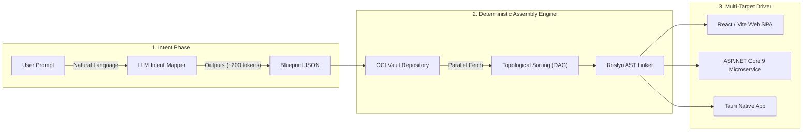

Don't get me wrong - I love GitHub Copilot, Claude, ChatGPT, and all the wonderful AI code-generation tools we have come to admire over the last couple of years. However, I feel there is a fundamental flaw in how we approach AI-based code generation. Most of these tools, whether Cursor, Lovable, or v0, operate on a fundamental assumption: **AI code generation should happen token-by-token, line-by-line, in real time.** and as visually appealing as it is, it hits a severe architectural ceiling when building enterprise applications. I am sure the teams behind these tools are aware of this, but the user experience of watching code stream line-by-line is just too compelling to move away from this approach. And honestly, there is nothing wrong with this approach for 90% of the use cases out there. However, for enterprise applications, this approach leaves a lot to be desired. This post is just my personal opinion on this approach and if you disagree with me, I would love to hear your thoughts in the comments below. I have also included my implementation plan for this approach in my GitHub repository for [Beloved](https://github.com/Digvijay/beloved).

In my opinion, while watching code stream line-by-line is visually impressive, it hits a severe architectural ceiling when building enterprise applications:

1. **Massive Token Waste**: Re-streaming 50,000+ tokens for small incremental edits costs **$0.50 to $2.00 per generation**.
2. **High Latency**: Waiting 2 to 5 minutes for LLMs to generate boilerplate text is unacceptable for high-throughput development.
3. **Probabilistic Hallucinations**: LLMs frequently hallucinate imports, break DbContext configurations, or produce invalid syntax and despite the self-healing and multi-try mechanisms, the success rate is far from 100% for enterprise applications.
4. **No Determinism**: The output is probabilistic - it changes every time you run it, which is a deal-breaker for enterprise applications where 100% consistency and auditability are required. 

I am not expert but still wanted to think out loud and believe that there is a far superior architectural pattern: **Deterministic Assembly**.

So, instead of asking an LLM to rewrite a database controller or authentication layer line-by-line, what if the LLM only outputs a **high-level blueprint JSON**, and an assembly engine stitches pre-audited, cryptographically signed OCI modules and generated code together in milliseconds?

So just to not remain purely academic, I thought to add a proof of concept of what I have been thinking. I am calling it **[Beloved](https://github.com/Digvijay/beloved)**.

---

## The Paradigm Shift: Text Generation vs. Module Assembly

For better mental visualization, let's compare it to building with LEGO bricks. Instead of melting plastic to mold a custom brick every time you need a wall, you open a box of pre-tested, standardized bricks and snap them together.

| Metric / Feature | Traditional LLM Code Generators (e.g. Lovable, Cursor) | AI Code Assembly (Beloved) |
|---|---|---|
| **Code Generation Strategy** | Line-by-line probabilistic token generation | Deterministic AST stitching of pre-vetted OCI modules |
| **Token Consumption** | ~50,000+ tokens per generation ($0.50 - $2.00) | **~100 - 500 tokens** per assembly (**$0.0001**) |
| **Generation Speed** | 2 - 5 minutes of streaming text | **< 3 seconds** parallel AST link & output bundle |
| **Build Reliability** | Vulnerable to syntax errors & missing imports | **100% deterministic build guarantee** via Roslyn AST |
| **Distribution** | Ephemeral, non-reusable text snippets | **OCI-Compliant Container Registry Artifacts** |

---

## High-Level Architecture

---

## 3 Core Takeaways for Enterprise System Designers

1. **Keep the LLM Out of the Hot Path**: Use LLMs exclusively for intent parsing and blueprint generation. Let deterministic compilers and AST manipulators build the actual files.
2. **Treat Code Modules as OCI Artifacts**: Standardize reusable backend controllers and React views as cryptographically signed OCI container layers.
3. **Guarantee 100% Build Success**: By linking pre-compiled, type-checked abstract syntax trees, you eliminate runtime syntax errors completely.

---

*In Part 2 of this series, we will dive deep into the C# 13 and Roslyn AST implementation of the Beloved Assembly Engine.*
