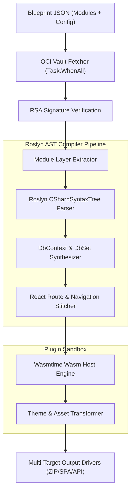

In my [previous post](/drafts/why-llm-code-generation-is-broken-ast-assembly), I shared some thoughts on why token-by-token code generation hits a wall for enterprise apps and why I believe deterministic assembly is a path worth exploring. 

After putting those ideas down on paper, I didn't want to leave it as just a philosophical opinion. So over the weekend, I rolled up my sleeves and built a working proof-of-concept called **[Beloved](https://github.com/Digvijay/beloved)**. 

In this post, I want to open up the hood and walk you through how I implemented the core Assembly Engine using C# 13 and .NET 9. We'll look at how Roslyn handles the AST stitching, how OCI container registries distribute pre-audited modules, and how Wasm plugins keep everything safe and extensible.

I am sharing this implementation to get feedback from fellow .NET architects and systems builders, so if you see areas for improvement or have alternative approaches, please drop a comment!

---

## Assembly Engine Component Architecture

Here is the high-level design of how the engine processes a request:



---

## The Lessons Learned While Building It

### 1. Parallel OCI Layer Fetching with `Task.WhenAll`
Instead of pulling modules sequentially, Beloved resolves the Directed Acyclic Graph (DAG) of dependencies and streams layers concurrently from OCI registries (`registry:2.8.2`). This turned out to be one of the biggest speedups:

```csharp
public async Task<IReadOnlyList<VaultModule>> FetchModulesAsync(
    IEnumerable<string> moduleUrns, 
    CancellationToken ct)
{
    var tasks = moduleUrns.Select(urn => FetchAndVerifyModuleLayerAsync(urn, ct));
    var modules = await Task.WhenAll(tasks);
    return modules;
}
```

### 2. Roslyn AST DbSet & Route Synthesis (No Regex Hacks!)
One thing I learned early on: regex search-and-replace for code stitching is a nightmare that breaks as soon as formatting changes. Using Roslyn to manipulate the actual Abstract Syntax Tree (AST) gives us 100% type safety and zero syntax errors when merging `AppDbContext.cs`:

```csharp
public SyntaxNode MergeDbSets(SyntaxNode originalContext, IEnumerable<DbSetDeclaration> newDbSets)
{
    var classDecl = originalContext.DescendantNodes()
        .OfType<ClassDeclarationSyntax>()
        .First(c => c.Identifier.Text == "AppDbContext");

    var newProperties = newDbSets.Select(d => 
        SyntaxFactory.ParseMemberDeclaration($"public DbSet<{d.EntityName}> {d.PropertyName} {{ get; set; }}"));

    var updatedClass = classDecl.AddMembers(newProperties.ToArray());
    return originalContext.ReplaceNode(classDecl, updatedClass);
}
```

### 3. Wasmtime Sandboxed Plugin Execution
To allow custom plugins without running arbitrary unvetted code directly on the host machine, I experimented with WebAssembly sandboxing using `.NET Wasmtime` bindings. It gives us a secure boundary while keeping execution lightning-fast.

---

## Initial Benchmark Observations

Here are some quick numbers from my local environment:
- **Assembly Time**: **< 420 ms** total Roslyn compilation and AST merge.
- **Memory Footprint**: Flat 120MB working set using `System.Text.Json` zero-allocation deserialization.
- **Security**: RSA signature check on all extracted `.tar.gz` module layers before linking.

What do you think of this approach? In the next post, I'll share how I deployed this control plane on Kubernetes using KEDA to handle autoscaling under load.
