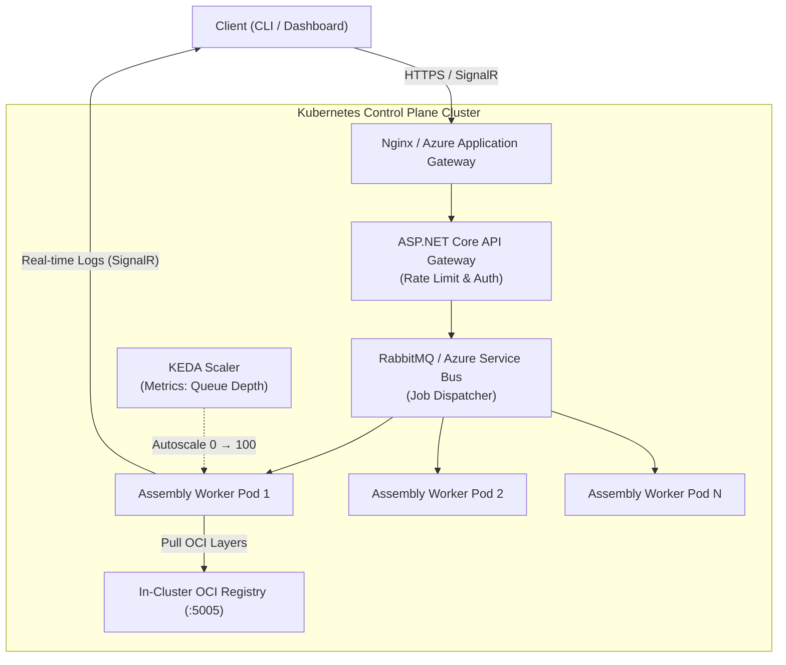

In the first two posts of this series, I shared my thoughts on [why deterministic code assembly makes sense](/drafts/why-llm-code-generation-is-broken-ast-assembly) and [how the .NET 9 Roslyn engine works under the hood](/drafts/building-high-throughput-assembly-engine-dotnet-9-roslyn-oci). 

Today, I want to tackle the cloud infrastructure side of the equation.

When building a tool like **[Beloved](https://github.com/Digvijay/beloved)** for real-world development teams, you quickly realize that local performance is only half the battle. You also need a cloud control plane that can handle unpredictable bursts of assembly requests from multiple developers, scale down to zero when idle to save costs, and stream live feedback to the user so they aren't staring at a blank screen.

Here is how I set up the Kubernetes infrastructure using ASP.NET Core 9, KEDA, and SignalR.

---

## Cloud Control Plane Topology

Here is the setup I landed on for the cluster architecture:



---

## Practical Infrastructure Decisions

### 1. Scaling Down to Zero with KEDA (Minimizing Cloud Bills)
One of my main goals was making sure idle environments don't waste cloud budget on Azure Kubernetes Service (AKS). Using **KEDA (Kubernetes Event-driven Autoscaling)**, the assembly worker pods scale down to **0 replicas** when there are no active jobs. 

The moment a developer submits a build request via `beloved generate`, KEDA detects the message queue depth and spins up worker pods within seconds:

```yaml
apiVersion: keda.sh/v1alpha1
kind: ScaledObject
metadata:
  name: beloved-worker-scaler
spec:
  scaleTargetRef:
    name: beloved-assembly-worker
  minReplicaCount: 0
  maxReplicaCount: 100
  triggers:
  - type: rabbitmq
    metadata:
      queueName: beloved-assembly-jobs
      mode: QueueLength
      value: "2"
```

### 2. Real-Time Feedback with SignalR
One thing I've learned from using modern developer tools: visibility builds trust. Rather than leaving the developer wondering if a job is stuck, ASP.NET Core SignalR streams assembly progress logs directly to the CLI terminal or Web Dashboard as each OCI module is fetched and linked.

---

## Wrapping Up the Series

Building **Beloved** as a proof-of-concept has been an incredible learning experience. To recap what we explored:
- Moving from token-by-token streaming to deterministic AST assembly.
- Using C# Roslyn and OCI registries for fast, type-safe compilation.
- Scaling cost-effectively on Kubernetes with KEDA and SignalR.

I'd love to hear your thoughts on this architecture! Have you experimented with alternative code-generation or assembly patterns in your own teams? Let me know in the comments below or join the conversation on GitHub at [github.com/Digvijay/beloved](https://github.com/Digvijay/beloved).
