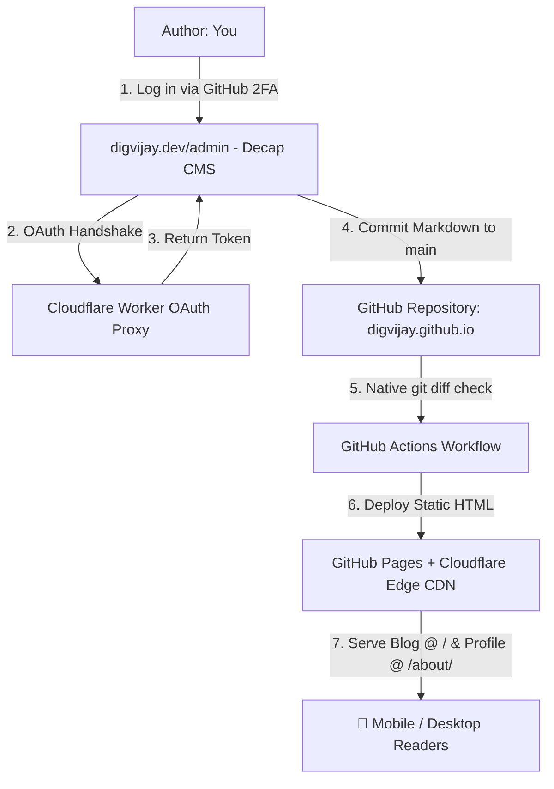

For a long time, I ran my personal website and blog (`digvijay.dev`) on a self-hosted **Ghost** instance running in my homelab, exposed to the world via **Cloudflare Tunnels**. 

Ghost is a fantastic blogging platform: the editing experience is top-notch, and the clean visual interface makes writing enjoyable. But as someone who works with cloud architecture every day, I eventually had to face a simple reality: **maintaining self-hosted infrastructure for a simple personal blog is unnecessary overhead.**

I wanted to get rid of self-hosting entirely, cut down maintenance to zero, stop worrying about homelab server uptime or patching Node dependencies on my homelab box, and host everything for free - all while keeping my custom domain, existing content, and a clean WYSIWYG editing experience protected by GitHub 2FA.

Here is how I built a zero-cost, zero-maintenance, 100% self-owned static architecture to replace my self-hosted Ghost setup.

---

## The Core Goals & Security Requirements

Before writing any code or migrating files, I set a few non-negotiable requirements:

1. **Zero Hosting Costs & Zero Server Maintenance**: Hosted on GitHub Pages with global Cloudflare CDN caching.
2. **Ghost-Like Web Editor**: Must have a clean visual WYSIWYG editor (`digvijay.dev/admin`) to write posts without touching raw Markdown files or code editors.
3. **Native GitHub 2FA Authentication**: Access to the editor must be locked down behind my GitHub account with 2FA enabled.
4. **Zero 3rd-Party SaaS Dependencies**: No external third-party CMS services (like Netlify or SaaS CMS vendors) getting write permissions to my GitHub repositories.
5. **Supply Chain & CI Security**: 
   - No unverified external CDN `<script>` tags (`unpkg.com`) loaded on the site; all CMS scripts are self-hosted in the repo and updated automatically via **Dependabot**.
   - Zero 3rd-party GitHub Actions for CI path filtering; uses 100% native POSIX `git diff` execution to eliminate supply chain vulnerabilities.
   - Fast content publishing: Blog content edits (`_posts/**`) bypass Node/npm setup entirely for sub-20s builds, while dependency updates (`package.json`) trigger automated CMS bundling.

---

## The Architecture

Here is the high-level flow of how the new stack works:

### 1. Static Engine: GitHub Pages & Jekyll
Instead of running a dynamic database and Node.js server for Ghost, blog posts now live as clean Markdown files inside `_posts/`. GitHub Pages automatically compiles them into static HTML at build time.
- **⚡ Page Load Speed**: Zero database queries, zero server-side processing. Pages load instantly worldwide.
- **🔍 Clean Navigation Structure**: Main blog articles live directly at the root (`/`), while professional bio and engineering details live at `/about/`.

### 2. The Visual WYSIWYG Editor: Decap CMS
To retain the Ghost editing experience, I embedded **Decap CMS** at `digvijay.dev/admin/`. It gives me a clean visual editor directly in the browser with live previews, media uploading, and formatting tools. When I click "Publish", Decap CMS commits a `.md` file straight to my GitHub repository.

### 3. Private OAuth Proxy: Self-Hosted Cloudflare Worker
Because static GitHub Pages sites cannot hide a GitHub OAuth `client_secret` on the client side, standard static CMS setups often rely on third-party SaaS authentication services.

Instead of delegating access to a third party, I deployed a lightweight serverless **Cloudflare Worker** (`decap-oauth-worker.digvijay.workers.dev`) running under my own Cloudflare account. 
- It securely handles the GitHub OAuth handshake.
- It verifies my login against my own GitHub OAuth App.
- Zero external services ever receive access to my repository.

### 4. Zero-Trust CI Pipeline with Native Path Filtering
In CI/CD, using third-party GitHub Actions with mutable tags (like `@v3`) introduces supply chain risks. To keep the pipeline 100% secure:
- We use a **native `git diff` step** to check if dependencies (`package.json`, `admin/`) changed.
- Markdown post edits (`_posts/**`) skip Node setup and `npm ci` entirely, deploying static Jekyll artifacts in under 18 seconds.
- Code or dependency updates automatically trigger Node 22 and `npm run copy-cms`, ensuring **Dependabot** updates work seamlessly without manual bundle management.
- Environment runtimes are pinned locally using [`mise`](https://mise.jdx.dev/) (`mise.toml`).

---

## Ghost vs. GitHub Pages + Decap CMS Comparison

| Feature | Ghost (Self-Hosted) | GitHub Pages + Decap CMS |
|---|---|---|
| **Monthly Cost** | Server & Tunnel costs | **$0 / month** |
| **Maintenance** | Docker updates, Node security patches | **Zero server maintenance** |
| **Editor** | Ghost Native Editor | **Decap CMS Visual Editor** |
| **Authentication** | Ghost local passwords | **Native GitHub 2FA** |
| **CI Security** | N/A | **Zero 3rd-Party Actions (Native `git diff`)** |
| **Uptime** | Dependent on homelab box | **99.99% Global Cloudflare Edge CDN** |
| **Backup** | Database dumps | **100% Git Version Controlled** |

---

## Conclusion

Migrating from self-hosted Ghost to GitHub Pages + Decap CMS + Cloudflare Workers completely eliminated server maintenance and hosting costs while keeping a top-tier visual writing experience protected by GitHub 2FA.

If you are running a personal blog on self-hosted infrastructure, moving to a static architecture backed by Cloudflare serverless workers is one of the best upgrades you can make.
